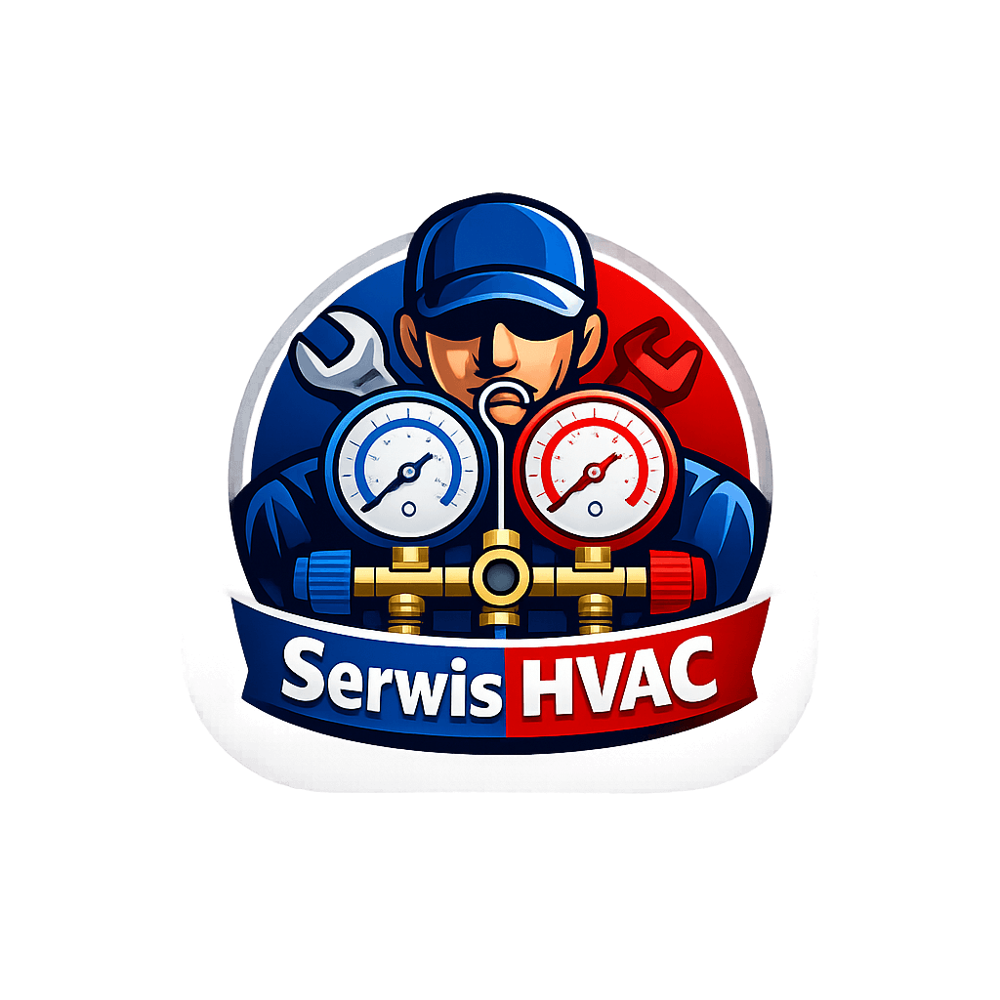

# HVAC Service App 🛠️❄️

**HVAC Service** to kompleksowa aplikacja mobilna zaprojektowana specjalnie dla instalatorów i serwisantów branży HVAC (klimatyzacja, pompy ciepła, wentylacja). Aplikacja automatyzuje proces dokumentacji, zarządzania bazą klientów oraz generowania profesjonalnych protokołów serwisowych bezpośrednio u klienta.

## 🚀 Kluczowe Funkcje

- **Zarządzanie Klientami i Urządzeniami**: Pełna baza danych klientów wraz z przypisanymi urządzeniami (model, nr seryjny, lokalizacja jednostek).
- **Skanowanie Tabliczek Znamionowych**: Zintegrowany system OCR do automatycznego odczytywania danych technicznych urządzeń za pomocą aparatu.
- **Zlecenia Serwisowe**: Śledzenie statusu prac (Otwarte, W toku, Zamknięte) z priorytetami.
- **Generator Raportów PDF**: Tworzenie profesjonalnych protokołów z logiem firmy, listą wykonanych czynności (checklistą), użytymi częściami i podpisem klienta na ekranie.
- **Dokumentacja Fotograficzna**: Możliwość dodawania zdjęć "Przed" i "Po" wykonaniu usługi.
- **Kalkulator Chłodniczy**: Narzędzie do obliczania przegrzania (SH), dochłodzenia (SC) oraz diagnozowania pracy układu w czasie rzeczywistym.
- **Magazyn Części**: Zarządzanie stanami magazynowymi i automatyczne powiadomienia o niskim stanie produktów.
- **Harmonogram**: Interaktywny kalendarz zaplanowanych wizyt serwisowych.

## 🛡️ Bezpieczeństwo i Prywatność

Aplikacja została zbudowana z myślą o najwyższym bezpieczeństwie danych:
- **SQLCipher**: Lokalna baza danych SQLite jest w pełni zaszyfrowana algorytmem AES-256.
- **Android KeyStore**: Klucze szyfrujące są bezpiecznie przechowywane w sprzętowym module bezpieczeństwa urządzenia.
- **Biometria**: Dostęp do aplikacji można zabezpieczyć odciskiem palca lub rozpoznawaniem twarzy.
- **Brak Chmury**: Wszystkie dane techniczne i dane klientów są przechowywane wyłącznie lokalnie na urządzeniu (Privacy by Design).

## 🛠 Stack Techniczny

- **Język**: Kotlin
- **UI**: Jetpack Compose (Modern Declarative UI)
- **Architektura**: Clean Architecture + MVVM
- **Wstrzykiwanie Zależności**: Hilt (Dagger)
- **Baza Danych**: Room + SQLCipher (Szyfrowanie)
- **Generowanie PDF**: iText7
- **Skanowanie**: ML Kit (Text Recognition)
- **Obrazy**: Coil
- **Nawigacja**: Compose Navigation

## 🌍 Obsługiwane Języki

Aplikacja jest w pełni zlokalizowana na następujące języki:
- 🇵🇱 Polski
- 🇺🇸 Angielski
- 🇩🇪 Niemiecki
- 🇸🇪 Szwedzki

© 2026 SerwisHvac by LuCaS
